# Chat History Management: The Hidden Hard Part of Agent Apps

When you build an agent or a chat agent, the hardest part is not the model call. It is the history. The moment you add streaming, title generation, session switching, and multi-agent support, state turns into a moving target. The bugs are subtle and the UX regressions are real.

This post is a simple, practical summary of what makes chat history painful and how to structure it so it stays reliable.

---

## Why chat history feels fragile

**1) Streaming changes timing.**  
Messages do not arrive as a single block. If you save too early, you store partial responses. If you save too late, you lose data on navigation or refresh.

**2) Sessions are not just IDs.**  
You are managing a lifecycle: create, stream, persist, title, reload, delete. Each step has different timing constraints.

**3) Multi-agent is a multiplier.**  
The moment you add multiple agents, you need separate active session tracking and clean isolation between histories.

**4) UX expectations are strict.**  
A single bad reload or lost message breaks trust. Users remember chat history glitches more than model quality.

---

## A simple, reliable architecture

Keep it modular and boring:

- **Database**: `ChatSession` + `ChatMessage`, with a cascade delete.
- **API**: CRUD routes for sessions and a `generate-title` endpoint.
- **Client store**: a single source of truth with `sessions`, `activeSessionId` per agent, and a small set of actions.
- **UI**: a history modal and a chat panel that only talks to the store.

The trick is not the structure, it is the timing.

---

## Architecture overview

### System diagram

```mermaid
flowchart TB
    subgraph UI["🖥️ USER INTERFACE"]
        direction LR
        ChatInput["**ChatInput**<br/>• Send message<br/>• Model selection<br/>• Web search toggle"]
        ChatMessage["**ChatMessage**<br/>• Render messages<br/>• Tool calls<br/>• Reasoning display"]
        ChatHistoryModal["**ChatHistoryModal**<br/>• List sessions<br/>• Select / Delete<br/>• New chat"]
    end

    subgraph State["📦 STATE MANAGEMENT"]
        ChatHistoryStore["**ChatHistoryStore**<br/>━━━━━━━━━━━━━━━━━━━━<br/>• sessions: ChatSession[]<br/>• activeSessionId: { [agentType]: string | null }<br/>━━━━━━━━━━━━━━━━━━━━<br/>fetchSessions() • createSession()<br/>deleteSession() • updateSessionMessages()"]
    end

    subgraph API["🔌 API LAYER"]
        direction LR
        GET_Sessions["GET /sessions<br/>*List all*"]
        POST_Sessions["POST /sessions<br/>*Create new*"]
        PATCH_Session["PATCH /sessions/:id<br/>*Update messages/title*"]
        GET_Session["GET /:id<br/>*Get with messages*"]
        DELETE_Session["DELETE /:id<br/>*Delete session*"]
        POST_Title["POST /generate-title<br/>*AI-powered titles*"]
    end

    subgraph DB["🗄️ DATABASE"]
        direction LR
        ChatSession["**ChatSession**<br/>• id, title, agentType<br/>• userId, timestamps<br/>• lastResponseId"]
        ChatMessageDB["**ChatMessage**<br/>• id, role, content, parts<br/>• sessionId (FK)"]
        ChatSession --- ChatMessageDB
    end

    UI --> State
    State --> API
    API --> DB
```



---

## A tiny guard that saves you

This single hash check prevents double-writes during streaming:

```ts
const messagesHash = JSON.stringify(messages.map((message) => message.id))
if (messagesHash === lastSavedMessagesRef.current) return
lastSavedMessagesRef.current = messagesHash
await updateSessionMessages(currentSessionId, messages)
```

---

## Timing rules that prevent most bugs

1) **Create a session only after the first message finishes streaming.**  
This avoids empty sessions and racing updates.

2) **Persist messages only after streaming completes.**  
Streaming means incomplete state; save after `status === 'ready'`.

3) **Use hash-based deduping before saves.**  
If message IDs did not change, skip the save. It prevents double writes.

4) **Generate a title once per session.**  
Track it in a ref or flag when loading history so it does not re-run.

5) **Guard against session switching races.**  
Use refs like `isCreatingSessionRef` and `justCreatedSessionRef` to skip the load effect when you know the state is still forming.

---

## A tiny session guard

This keeps history loading from racing new session creation:

```ts
if (
  currentSessionId &&
  (isCreatingSessionRef.current ||
    justCreatedSessionRef.current === currentSessionId)
) {
  if (justCreatedSessionRef.current === currentSessionId) {
    justCreatedSessionRef.current = null
  }
  return
}
```

---

## Important details you should not skip

- **Schema fields that matter**: `agentType` for multi-agent isolation, `lastResponseId` for reasoning model continuity, and `parts` for tool calls and citations.
- **API surface**: list, create, get, update, delete sessions, plus a `generate-title` endpoint for smart titles.
- **Store shape**: keep `sessions`, `activeSessionId` per agent, and an `isInitialized` flag to avoid double loads.
- **Streaming flow**: save only after the stream ends and dedupe with a hash of message IDs.
- **Title generation**: generate once, then store it and mark the session as titled on load.
- **Ownership checks**: every read or write should verify the session belongs to the user.
- **Deletion safety**: cascade delete messages to avoid orphans.

---

## The minimal checklist

- Schema with `ChatSession` and `ChatMessage`
- CRUD APIs (list, create, get, update, delete)
- Store with session list + active session per agent
- Load history with a clear loading state
- Save only after streaming ends
- Deduplicate saves with a hash of message IDs
- Title generation runs once per session
- Deleting a session clears it if it is active

---

## Final Verdict

If your agent feels flaky, it is probably a history problem. Solve the lifecycle first, keep the model call simple, and most of the "AI bugs" disappear. The agent is only as good as the memory you can reliably store and restore.
