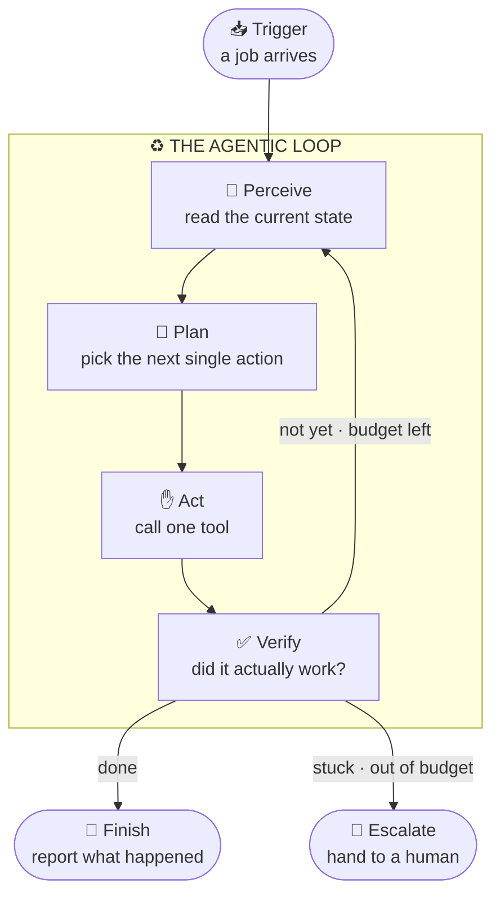
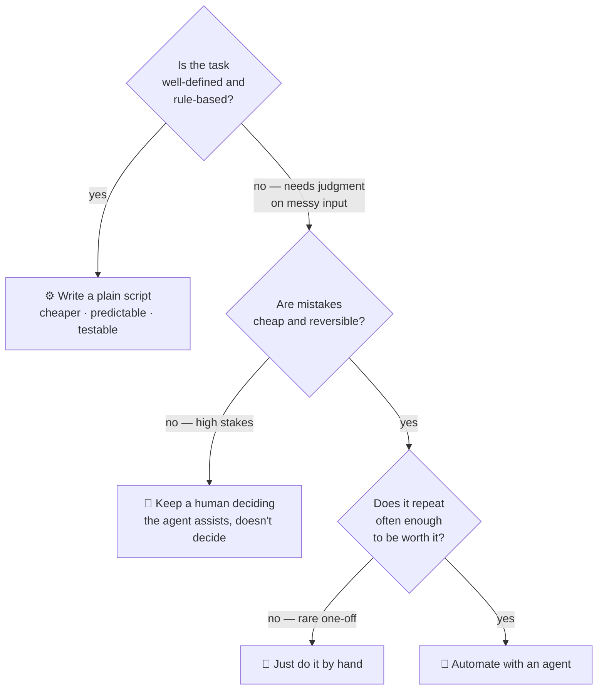

# The Agentic Automation Playbook: Patterns That Actually Hold Up

An agent that can do a task *once*, while you watch, is a magic trick. It's impressive, and it tells you almost nothing about whether you can leave it running.

An *automation* is a different promise. It says: this job will get done, correctly, a hundred times in a row, on inputs I haven't seen, while I'm asleep — and when it can't, it will tell me instead of quietly making a mess.

The distance between those two things isn't a smarter model. It's a handful of plays you run every time. None of them are clever. All of them are the difference between a demo and something you'd actually wire to your inbox, your database, or your customers. Here's the playbook.

---

## The engine: one small loop

Strip away the jargon and every agentic automation is the same loop running over and over. It looks at the world, decides one thing to do, does it, and then checks whether that actually worked. Repeat until the job is done — or until it's clearly stuck and needs to tap out.



The whole playbook below is really just five ways of making this loop trustworthy. The model lives inside the **Plan** box — the smallest box in the picture. Everything else is the part *you* design.

---

## Play 1 — Scope it like a job description, not a wish

The fastest way to get a flaky automation is to ask for too much. "Manage my email" is a wish. "Label each unread email with exactly one topic" is a job. Wishes have no edges, so the agent wanders. Jobs have edges, so the agent finishes.

A good scope answers four questions up front: what *done* means, what the agent is allowed to touch, and when to give up. Write it down as a contract before you write a single prompt.

```
# A scoped job, not a wish.
job = {
  goal:          "Label every unread support email by topic",
  inputs:        ["the unread email"],
  allowed_tools: ["read_email", "set_label"],   # and nothing else
  done_when:     "every unread email has exactly one topic label",
  give_up_after: 3 attempts,
}
```

Notice what this buys you: a clear finish line (so the loop knows when to stop), a short list of allowed tools (so it *can't* go off-script), and a give-up rule (so it can't run forever). You haven't constrained the intelligence — the model still decides *how* to label each email. You've constrained the blast radius.

---

## Play 2 — Give it few tools, small and reversible

Every tool you hand an agent is a door it can walk through. The instinct is to hand over a master key — "here's database access, figure it out." Don't. Hand over the smallest, dullest keys that get the job done, and prefer the ones that don't break anything.

Three rules make a tool safe:

- **Typed and narrow.** The tool accepts a specific shape and rejects anything else. It does not "interpret" sloppy input — it refuses it.
- **Least power.** A "label email" tool can label. It cannot delete, send, or forward. Capability is granted on purpose, never by accident.
- **Reversible first.** Where you can, prefer actions you can undo — a label you can remove beats a deletion you can't. For the scary stuff, offer a *dry run* that reports what *would* happen.

```
tool "set_label":
  input   { email_id: string, label: one_of[BUG, BILLING, QUESTION, OTHER] }
  power:  least          # can label; cannot delete, send, or read other inboxes
  effect: reversible     # a label can be removed if it's wrong
  on_bad_input: reject with a clear reason — never guess
```

A bare LLM with raw access is a confident intern with the company credit card. The same model behind three small, reversible tools is a teammate who can only do the job you actually gave them. Same intelligence — wildly different risk.

---

## Play 3 — Never skip the Verify step

This is the play people drop, and it's the one that matters most. It is tempting to assume that because the tool returned "success," the job is done. It isn't. The tool succeeded; the *goal* may not have.

Real automation closes the loop: after acting, it goes back and reads reality to confirm the world actually changed the way it intended. Act-without-verify isn't automation — it's hope on a schedule.

```
result = act(tool, args)

check = verify(goal, result)     # re-read the world; don't take the tool's word for it
if check.ok:
    accept(result)
else:
    remember(check.reason)       # feed the failure back into the next Plan
    retry()                      # the loop runs again — now it knows what went wrong
```

The quiet magic here is that last bit: a failed verify isn't a dead end, it's *information*. When the reason for failure flows back into the next Plan step, the agent gets a chance to course-correct — which is exactly the thing agents are good at and plain scripts are not. Verification is what turns a guess into a self-correcting loop.

---

## Play 4 — Build the escape hatch

An automation that can't fail safely will eventually fail catastrophically. The two ways a loop goes wrong are *running forever* and *failing silently*. You prevent both with the same move: hard limits, and a loud exit when you hit them.

Give every run a budget — a maximum number of attempts and a ceiling on cost or time. When it blows the budget, the agent doesn't keep grinding and it doesn't pretend it succeeded. It escalates: it stops, packages up what it was doing, and hands the problem to a human.

```
attempts = 0
spent    = 0

while not done:
    if attempts >= MAX_ATTEMPTS or spent >= COST_BUDGET:
        escalate(reason="hit a wall", context=last_state)   # fail loudly, hand off
        break
    step      = run_loop_once()
    attempts += 1
    spent    += step.cost
```

"Escalate to a human" feels like an admission of defeat. It's the opposite. The automations you can trust the most are the ones that know their own limits — they let the agent handle the 95% it's good at and route the weird 5% to someone who can actually decide. A loop with no exit isn't ambitious; it's a runaway bill waiting to happen.

---

## Play 5 — Make every run safe to repeat

Because of Play 4, your automation *will* retry, and because the world is messy, sometimes it will retry an action it already did. If a retry can double-charge a customer or send the same email twice, you don't have an automation — you have a footgun on a timer.

The fix is **idempotency**: make repeating an action a no-op. Give each action a key derived from the job and the operation, and check whether you've already done that exact thing before doing it again.

```
# Same job + same action = same key. A retry must never charge twice.
key = idempotency_key(job.id, action)

if already_done(key):
    return cached_result(key)    # we've done this; just return what happened
result = act(...)
record(key, result)              # remember it, so the next retry is safe
```

Pair this with plain observability — log what the agent perceived, decided, did, and verified at each step. When something does go sideways (and it will), the difference between a five-minute fix and a five-hour mystery is whether you can *see* what the loop was thinking.

---

## The meta-play: should this even be an agent?

The best automation is sometimes not an agent at all. Agents earn their cost on tasks that need judgment over messy, unpredictable input. For everything else, a plain script is cheaper, faster, and easier to trust. Before you reach for an agent, walk the gate:



A surprising number of "we need an AI agent" problems are really a script with three `if` statements, or a decision that should stay with a person. Knowing when *not* to automate is the play that saves you the most pain.

---

## Final Verdict

Effective agentic automation isn't about a bigger model. It's about a small, honest loop wrapped in five disciplines: **scope it tightly, give it few reversible tools, always verify, build an escape hatch, and make every run safe to repeat.**

Run those plays and the model gets to do what it's genuinely good at — making judgment calls on messy input — while the structure around it makes sure the job finishes, stays in bounds, and leaves a trail. The demo proves the agent is clever. The playbook is what makes it dependable.

---

## Further reading

- [Anthropic — Building effective agents](https://www.anthropic.com/research/building-effective-agents) — why simple, composable patterns beat elaborate frameworks.
- [Google — Agents whitepaper](https://www.kaggle.com/whitepaper-agents) — the perceive-plan-act loop and tool use, from the ground up.
- [OpenAI — A practical guide to building agents](https://cdn.openai.com/business-guides-and-resources/a-practical-guide-to-building-agents.pdf) — scoping, guardrails, and human handoff in practice.
- [Martin Fowler — LLM-powered autonomous agents and the verify loop](https://martinfowler.com/articles/exploring-gen-ai.html) — engineering discipline around non-deterministic systems.

Follow me here: [github.com/soummyaanon](https://github.com/soummyaanon)
