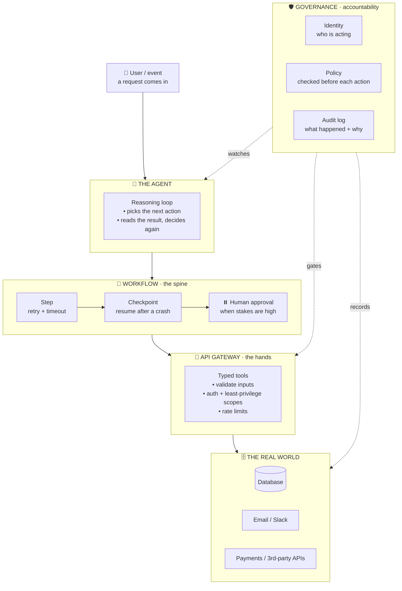

The demo always works. One prompt, one tool call, a clean answer, and the room nods. Then you put the same agent in front of real users and it starts doing things you never saw coming: repeating itself, calling the wrong tool, confidently doing the wrong thing and leaving no trace of why.

Here's the uncomfortable part: the model didn't get worse. A demo and a product are just different animals. A demo has to work once, for you. A product has to work a thousand times, for strangers, while things fail around it.

After building a few of these, the same three gaps show up every time. The agent has no spine, so it doesn't know how to *work*. It has no safe hands, so it can't *touch* anything without risk. And it has no conscience, so nobody can *answer* for what it did. In plainer words: **workflows, APIs, and governance.**

---

## What "production-ready" actually looks like



The model is the smallest box in that picture, and that's the point. Everything around it is what turns a clever demo into something you can leave running. Let's take the three pillars one at a time.

---

## 1. Workflows — give the agent a spine

In the demo, the task is one turn: ask, answer, done. Real tasks aren't like that. "Onboard this customer" is six steps, two of which call flaky services, one of which should wait for a human, and any of which can fail halfway through.

Hand that to a bare LLM loop and you get one of three bad endings: it gives up early, it loops forever, or it quietly skips the step that mattered. The model is good at *deciding* the next move. It is terrible at *guaranteeing* the whole job finishes.

That guarantee is what a workflow gives you. You model the task as explicit steps with retries, timeouts, and checkpoints. The agent still chooses what to do at each step, but the workflow makes sure the step actually ran, retries it when the network blips, pauses for a human when the stakes are high, and picks up where it left off if the process crashes. The agent improvises; the workflow remembers.

---

## 2. APIs — clean hands, not raw access

In the demo, you let the agent run SQL straight against the database, or you hand-roll a one-off function for every little thing it needs. It's fast, and you're the only user. In production, that same direct access is how an agent deletes the wrong rows at 2am over a slightly ambiguous prompt, and that pile of bespoke, untyped tools becomes impossible to secure.

Every capability the agent has should sit behind an API with a contract: typed inputs you can validate, scoped permissions so a "send email" tool can't also drain a bank account, rate limits, and a clear boundary you can reason about. "Tools," in agent-speak, are really just well-governed APIs wearing a friendly name.

The bonus is that an API gateway lets you enforce the boring-but-critical stuff — authentication, quotas, logging — in one place, once, instead of re-implementing it inside every agent you'll ever build. The agent gets hands it can use without you holding your breath.

---

## 3. Governance — someone has to answer for it

In the demo, nobody asks what the agent did. In production, the day it emails the wrong customer, approves a refund it shouldn't have, or burns $400 in tokens overnight, someone *will* ask: "Why did it do that, and who let it?" If your answer is a shrug, you don't have a product. You have a liability.

Governance is the unglamorous trio that answers that question:

- **Identity** — the agent acts *as* a specific, scoped identity, not as a vague "the AI." You always know who was on the keyboard.
- **Policy** — what it's allowed to do is checked *before* the action, not discovered after. The rules live outside the prompt, where a clever input can't talk its way past them.
- **Audit** — every meaningful action leaves an immutable record of what happened and why, so you can explain it, debug it, or prove it later.

It sounds like bureaucracy. It's the opposite. Governance is the seatbelt that lets you drive faster — the more you can account for, the more you can safely let the agent do.

---

## Tying it together in code

Here's the shape of a single workflow step. Notice how all three pillars show up in a few lines: the workflow drives it, an API client does the touching, and policy plus audit keep it accountable.

```ts
// One workflow step. The agent proposes; the system stays in charge.
// workflow (spine) · api client (hands) · policy + audit (accountability)
async function runStep(agent: AgentContext, tool: ToolCall) {
  // GOVERNANCE — check the policy *before* anything happens.
  const decision = await policy.check({
    actor: agent.identity,   // a real, scoped identity — not "the AI"
    action: tool.name,       // e.g. "payments.refund"
    args: tool.args,
  });
  if (!decision.allowed) {
    await audit.log({ ...tool, actor: agent.identity, status: "blocked", reason: decision.reason });
    return { ok: false, reason: decision.reason }; // tell the agent why, let it adapt
  }

  // APIs — go through a typed, scoped client, never the raw system.
  const result = await api.invoke(tool.name, tool.args, {
    token: agent.scopedToken, // least-privilege credentials, just for this step
    timeoutMs: 10_000,
  });

  // GOVERNANCE — write down what happened, so someone can answer for it later.
  await audit.log({ ...tool, actor: agent.identity, status: "ok", output: result.summary });
  return { ok: true, result };
}
```

And the workflow is what decides this step runs at all, and what to do when it doesn't:

```ts
// The spine: retry on failure, pause for a human, survive a crash.
const step = await withRetry(() => runStep(agent, nextTool), { tries: 3 });
if (step.needsApproval) await pauseForHuman(step); // resume later, even after a restart
```

None of this is exotic. It's the same discipline we already apply to any system that touches money, data, or users. We're just pointing it at an agent.

---

## Final Verdict

The model is not your product. The system around it is. Workflows give the agent a spine so the work actually finishes, APIs give it hands it can use without breaking things, and governance gives it the paper trail that lets you sleep at night.

Get those three right and most of your "AI bugs" turn out to be ordinary system bugs — the kind you already know how to fix. The demo proves the model is smart. These three pillars are what make it trustworthy.

---

## Further reading

- [Tyk — AI and enterprise workflows](https://tyk.io/blog/ai-and-enterprise-workflows-essential-tools-and-trends-that-tip-the-balance/) — the workflow layer for real agent tasks.
- [Kong — Scale and govern agentic infrastructure](https://konghq.com/solutions/agentic-ai-workflows) — treating agents as API traffic you can manage.
- [Deloitte — API governance for agentic AI](https://www.deloitte.com/us/en/services/consulting/articles/api-governance-agentic-ai.html) — where APIs and governance meet.
- [IBM — AI agent governance: big challenges, big opportunities](https://www.ibm.com/think/insights/ai-agent-governance) — why accountability is the hard part.
- [Palo Alto Networks — Agentic AI governance guide](https://www.paloaltonetworks.in/cyberpedia/what-is-agentic-ai-governance) — identity, policy, and guardrails in practice.

Follow me here: [github.com/soummyaanon](https://github.com/soummyaanon)
