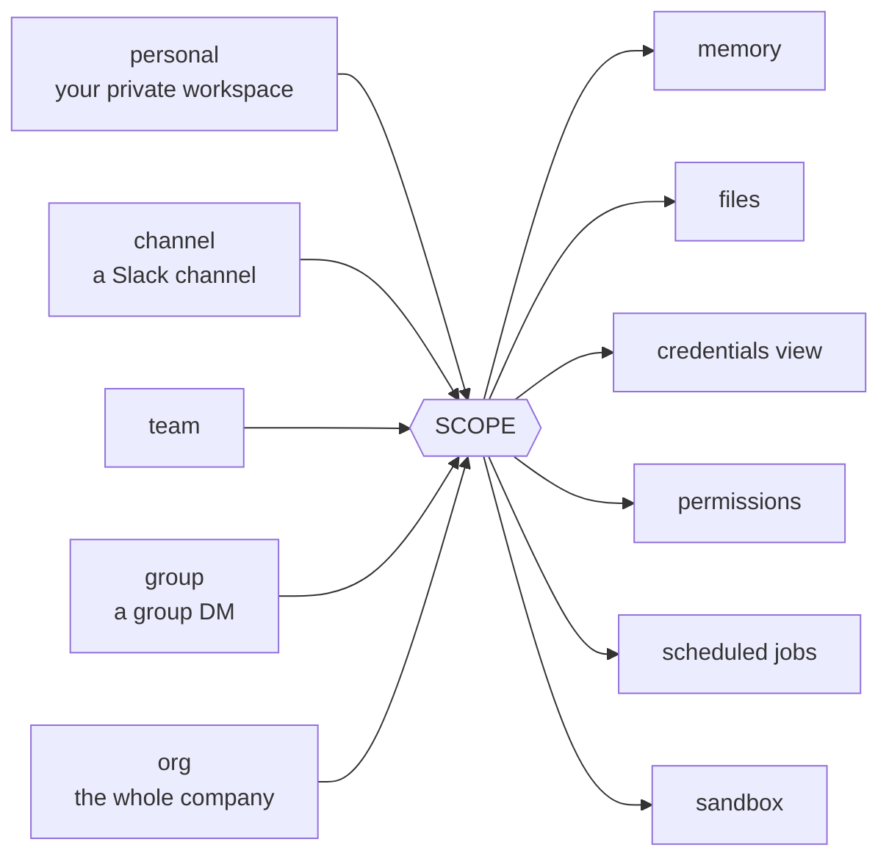
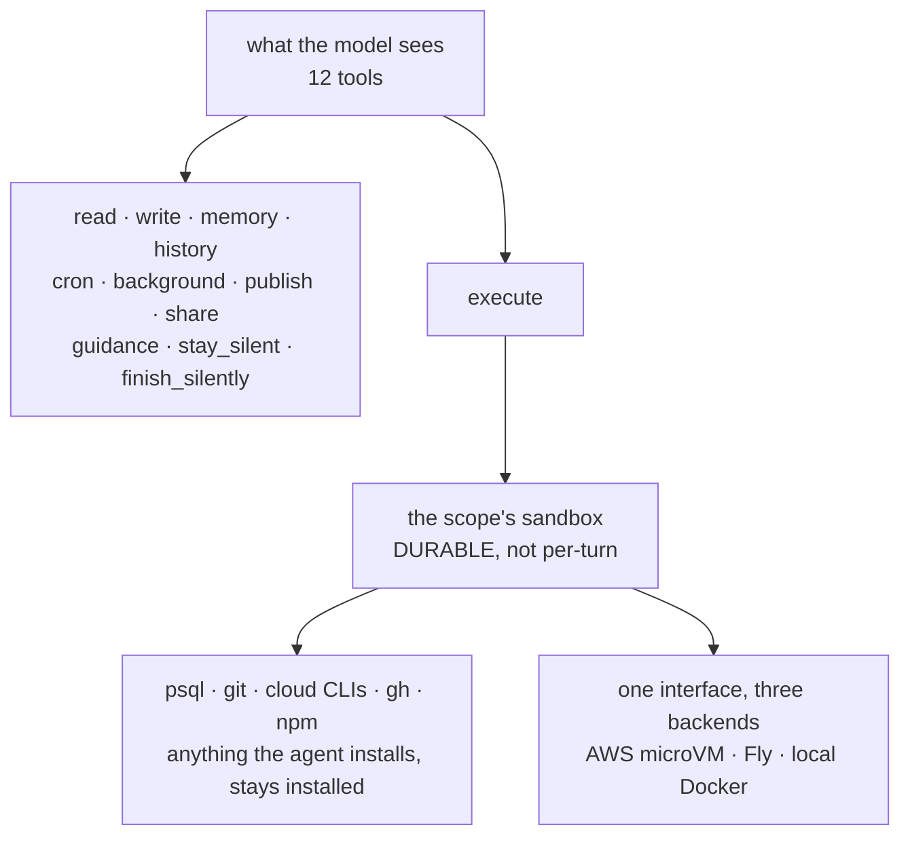
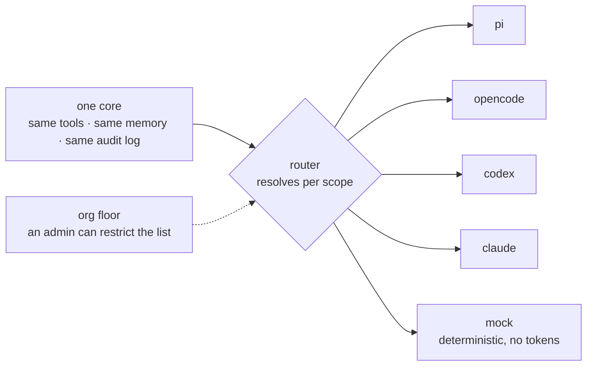
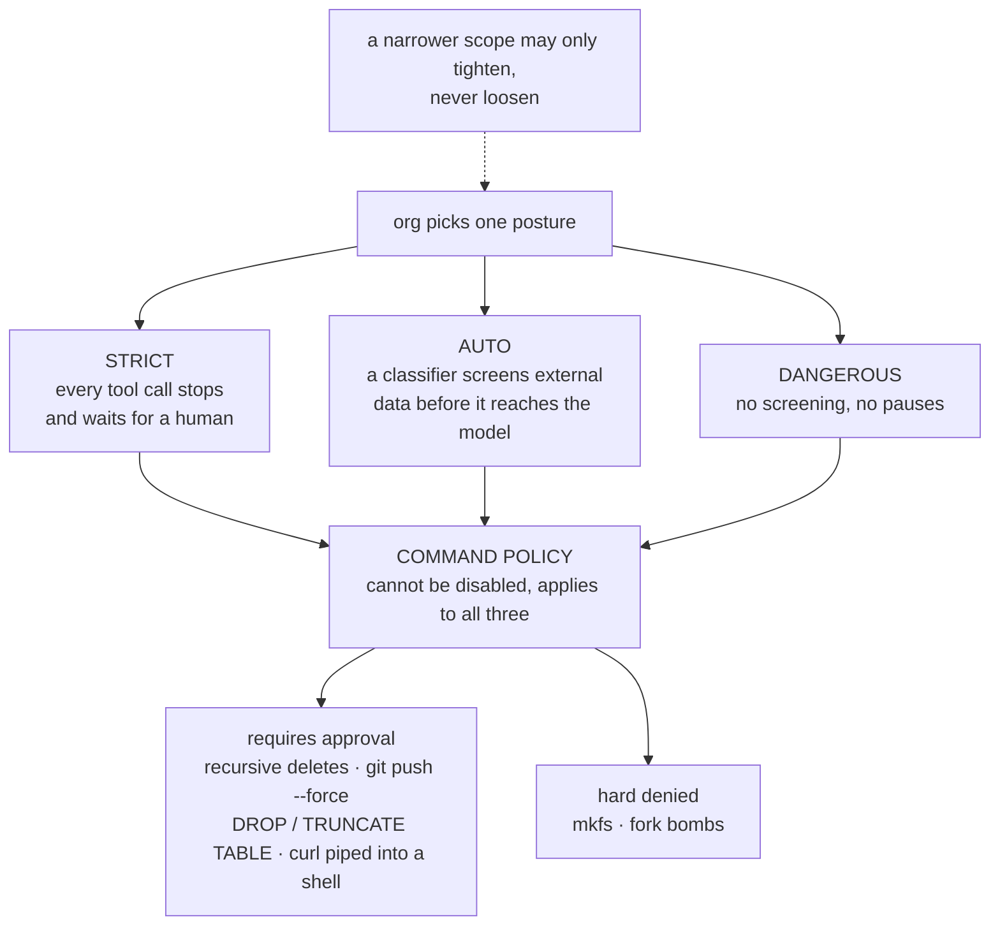
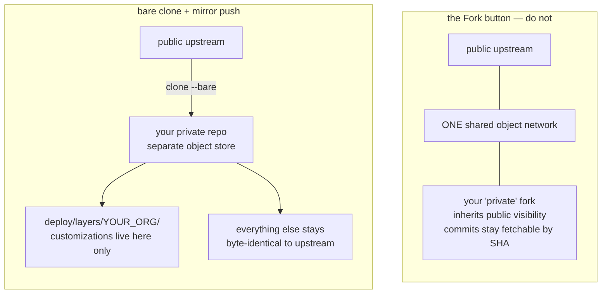

On July 31, YC open sourced QM. It is the agent they use internally for accounting, legal, events, and engineering. They also used it to build itself.

Most "open source agent" releases are a wrapper around an API call with a nice README. This is not that. I cloned it and counted.

- **342** source files — **74,814** lines of TypeScript
- **392** test files — **90,196** lines of tests
- **3,696** test cases

There is more test code than product code. That ratio tells you more about the project than any launch post could.

I spent a few hours reading it properly. Below is what I found — including the parts that are genuinely clever and the parts that worry me.

---

## The one idea that changes everything

Almost every agent you have used assumes one thing: one user.

ChatGPT has your memory. Claude Code has your repo. Your Cursor session is yours. When you try to stretch that model across a company, it snaps. Whose memory is it? Who can see the files? What happens when finance and engineering both want the same agent to behave differently?

QM does not treat the user as the unit. It treats the **scope** as the unit. There are exactly five kinds, and every one of them independently owns its own everything.

Your personal agent knows your writing voice. The `#eng` channel agent knows the deploy runbook. They are the same system and they do not leak into each other.

That sounds like a small modeling choice. It is not. It is the entire reason this works for a company instead of a person, and you can feel it in the code — scope is threaded through everything rather than bolted on.

---

## Twelve tools. One of them is a whole computer.

I expected a giant pile of tools. Search this, read that, call this API. There are twelve, and that is the entire surface the model sees.

The trick is `execute`.

`execute` runs commands inside a sandbox that belongs to that scope, and the sandbox is durable. Install a CLI tool on Monday, it is still installed on Friday. Log into a service, you stay logged in. It is not a throwaway container that resets every turn. It is the agent's computer.

This is a much better bet than the alternative. Instead of writing a tool for every integration a company might want, you give the agent a real machine and let it use the tools that already exist. Want it to talk to your database? It has `psql`. Your cloud? It has the CLI. Your repo? It has `git`.

---

## It is not married to a model vendor

This is the part I did not expect, and respect the most. QM runs five harnesses behind one interface — not five API providers, five entire agent harnesses.

Claude Code, OpenAI's Codex, OpenCode, and Pi all drive the same core, the same tools, the same memory, the same audit log. Resolution happens per scope, with the org able to set a floor. Marketing can run one model. The engineering channel can run another.

That fifth harness, `mock`, is why the test suite is so big. They can run the full system deterministically without burning tokens. A boring engineering decision that pays for itself a hundred times over.

The practical consequence: if your model provider raises prices or goes down, you change a config value. You do not rewrite your company's agent.

---

## The security model is three words

An org picks one posture. Narrower scopes can only make it **tighter**, never looser. That composition rule is a rank comparison in about ten lines of code, and it is the whole governance story.

Underneath all three sits a command policy that cannot be turned off.

I like this a lot. "Dangerous" still has a floor. There is no configuration that lets your agent quietly run `rm -rf` without someone saying yes.

The Auto screener is the interesting one. Every piece of text that reaches the model carries a provenance label saying where it came from. A classifier reads untrusted content and decides whether it is trying to hijack the agent. The prompt for that classifier is in the repo and it is unusually careful — it explicitly distinguishes *a human asked the agent to do something* from *a webpage is telling the agent to ignore its instructions*.

---

## The most honest file I have read in an open source repo

`SECURITY.md` has a section called "Known limitations." It is roughly 60 lines and it is a list of everything the system cannot do. Not vague hedging — specifics. In their own words:

> Command policy is bypassable. It is a speed bump against mistakes and injection, not a sandbox boundary.

> Classifier approval is not authorization and cannot guarantee prompt-injection resistance.

They also state plainly that sandbox credentials sit in plaintext while in use, that admins can read sensitive content with the read audited rather than consent-gated, and that published-app capability links are bearer authorization — anyone holding the link can reach the app.

Read that again. A company shipping an AI product wrote down, in the repo, that its prompt injection defense is not a guarantee and its command policy can be worked around.

Every AI security vendor selling you a "guardrail" right now should be asked to publish the equivalent list. Most of them cannot, because most of them are selling the classifier *as* the boundary. QM says out loud that the classifier is not the boundary.

If you evaluate one file from this repo, make it this one.

---

## The engineering rules are written for agents, not humans

There is an `AGENTS.md` at the root. `CLAUDE.md` is a symlink to it, so every coding tool reads the same file. Small thing, quietly smart.

The rules in it are the most opinionated part of the repo:

- **Fix every instance, not just the reported one.** Find a bug, grep the whole repo, fix all of it in the same change.
- **Fixes should make the system simpler, not more complex.** If a fix grows the surface area, find the version that shrinks it.
- **Never leave comments in the repo.** Zero. No docblocks, no TODOs, no commented-out code. Express intent through names and structure; rationale goes in commit messages.
- **Never merge to main without a fresh-context pass that tries to break the change.** And explicitly: never self-review in the context that wrote the code.
- **Durable by default.** No state in process memory. It runs multi-instance and blue-green, so an in-memory `Map` is wiped by every deploy. If an operator reads it back later, it lives in Postgres.

I checked the comment rule properly, because it is easy to write a rule and ignore it.

Across 74,814 lines of source there are 13 comment lines and 2 docblocks. That is not zero, so I went and read all 13.

Every single one is a concurrency trap. Two handlers racing for the same run. A message folded into a live turn that would post the reply twice. A silent ambient handler that must not report a failure the addressed caller owns.

That is the rule working exactly as intended. Comments are not banned because comments are bad. They are banned so that the few that survive are load bearing. When you see one in this codebase, something is about to bite you.

On self-review, their reasoning is the sharpest sentence in the repo:

> The context that produced a diff already believes it is correct, and that belief is the bias review exists to defeat.

That applies to humans too.

---

## They do not want your code

`CONTRIBUTING.md` asks for something unusual: pull requests in the form of human-written text. Describe your idea the way you would to a coworker over Slack. If they agree with the change, they will spend their own tokens on the implementation. And, in a line that made me laugh and then made me think:

> Please do not have AI artificially expand what you'd like to do into a formal proposal.

You submit a `.txt` file describing an idea. They implement it.

This is the first contribution policy I have seen that takes the current state of the world seriously. Writing code is cheap now. Knowing what to build is not. So they optimized the pipeline for the scarce thing. They are asking for the signal, not the padding.

---

## A detail most people will skip, and should not

Companies run QM from private forks. The README is emphatic that you must **not** use GitHub's Fork button. You clone it instead.

The reason is real, and most engineers do not know it.

A GitHub fork inherits the visibility of the repo it came from. Fork a public repo and you cannot make it private. Worse, forks share one object network with the parent, so commits you push to your "private" fork stay fetchable by SHA from the public side.

Keeping everything outside `deploy/layers/` byte-identical to upstream is what keeps merges small. Two skills maintain the boundary in both directions: one merges upstream in, one sends a fix back out after scrubbing it for company identifiers.

They also warn that private forks must never reference an upstream issue by number, because GitHub mirrors that mention onto the upstream item as a permanent timeline event — exposing the fork's existence. That is an operational detail somebody clearly got burned by once.

---

## What I am not sold on

Fair is fair. Three things.

**It is heavy.** Postgres, a sandbox provider, an egress proxy, a Slack app, a web UI, an admin panel, a portal. This is not a weekend deploy. The CLI walks you through it, but you are standing up real infrastructure in your own cloud.

**The blast radius is by design.** The whole pitch is that the agent acts as you, with your credentials. That is what makes it useful and it is also the risk. `SECURITY.md` says plainly that a compromised agent process can spend or exfiltrate any credential in its sandbox. Scope isolation limits the damage. It does not eliminate it.

**The public history was reset.** First commit is literally "Fresh repo history" on July 29, two days before launch. PR numbers jump around because of it. That is normal for a scrubbed internal release, but it means you cannot read the real evolution of the design — only the finished shape.

---

## Who should actually look at this

If you are building a company-wide agent, read it before you write yours. The scope model alone will save you a rewrite.

If you are building agent infrastructure, read the harness interface and the security posture composition. Both are small and both are correct.

If you are on a security team, read `SECURITY.md` and then go ask your AI vendors for their version of it.

If you just want a personal assistant, this is not for you. Use Claude Code.

The stack, for the curious: TypeScript running directly on Node 24 with no build step, Fastify for HTTP, Postgres with pg-boss for the queue, Slack Bolt, and Lit plus Vite for the web UI. MIT licensed. Deploys to your own AWS or Fly account.

The most interesting thing about QM is not any single feature. It is that a company ran their own operations on this, felt every sharp edge, wrote the sharp edges down honestly, and then handed the whole thing over for free.

That is rarer than the code.

---

Repo: [github.com/yc-software/qm](https://github.com/yc-software/qm) · Site: [qm.ycombinator.com](https://qm.ycombinator.com) · MIT licensed.
